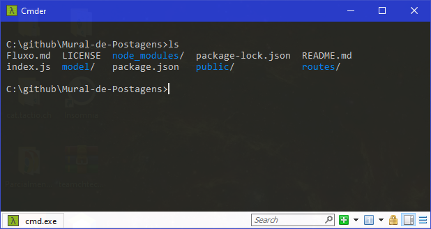
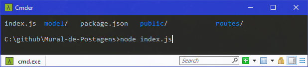
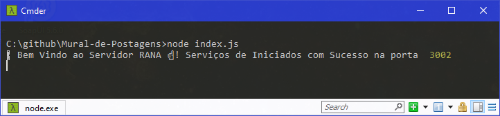

# Fluxo de Estudos - Integrando Front e Back-end
## Indice 📗
1. **Introdução**
2. **Fluxo lógico**
3. **Como Usar**

## Edições ✏️📑

Alterações   | Data
:---------: | :------:
Emissão Inicial | 09/10/2021
Vazio | Vazio

### Tecnologias Usados
#### Front-end

#### Back-end

### 1. 🚪 Introdução

   Iniciando, o este pequeno programa integra o front e o back-end usando
o **fetch** do JSvanilla de forma estática.
Ou seja o usuario manda uma requisição e recebe um arquivo preparado com HTML CSS JS, depois de carregado no navegador, o JS será resposável por tratar essa requisição para o NODEjs. 
Assim, o NODEjs responde o JS com apenas os dados, em seguida o JS pega os **Dados** e adicionar para o usuário na página HTML.

### 2. Fluxo lógico 

1. O Usuário acessar "Manda requisição servidor"
2. O Servidor responde com **HTML CSS Javascript**.
3. O Usuário faz nova requisição com Javascript com _FETCH_ .
4. O Servidor **NODEjs** responde com _DADOS_.
5. O Javascript com _FETCH_ poen esses _DADOS_ na tela "HTML".

### 3. 👇🤘 Para Usar

1. Clone o projeto 
2. Entre no Diretorio no **CMD ou em Outro terminal** de comando.
3. Entre na pasta pelo caminho dela.

4. 👇✋ Digite node index.js no Terminal digite ENTER

5. 🚀 Entre no navegador e digite "**localhost:3002**"

6. ⚠️📉📌 Agora, e só utlizar o portal de avisos.

